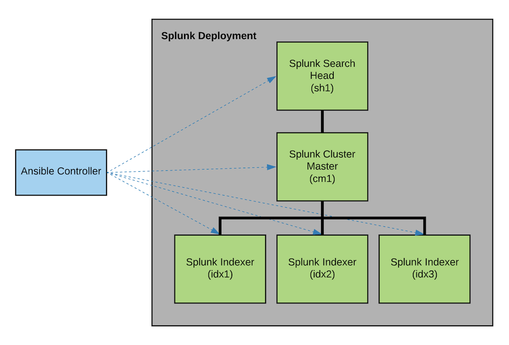

# Remote Execution
This folder provides guidance in how to use `splunk-ansible` from a controller node, setting up and provisioning a Splunk Enterprise indexer cluster on a series of remote instances. Or visually, the example shown here can be represented by the diagram below:



## Configure hosts
First, we'll need a few hosts to run these Ansible plays against. These can be bare-metal machines in a datacenter, cloud-provisioned VMs, or for demonstration purposes a set of containers running `sshd` locally. For more information on what's in the container image used, please see the [Dockerfile](./Dockerfile) in this directory.

Additionally, see the [docker-compose.yml](./docker-compose.yml) file included for how the multiple containers are defined to assume the roles in the Splunk deployment.
```bash
$ docker-compose up -d
```

## Setup hosts file
Ansible's inventory files are used to define the multiple nodes or hosts you plan on managing. For more information, see [how to build your inventory](https://docs.ansible.com/ansible/latest/user_guide/intro_inventory.html#inventory-basics-formats-hosts-and-groups) on Ansible's documentation. 

For our use case, we will be add all the hosts used to compose the indexer cluster in the [hosts.yml](./hosts.yml) file. The key things here are:
* Each host is added to the respective group matching the Splunk role it expects to fulfill
* In addition to group membership, each instance should have a matching `splunk.role` variable defined
* All top-level variables, including SSH connection parameters - for instance user, password, and port - can be included in `all.vars`
* Host-specific variables can be defined at the individual host level

Given that we are using Docker containers for the target hosts in this example, the corresponding `hosts.yml` file will look like the following:
```
all:
  vars:
    # These vars are used to access the remote hosts
    ansible_user: root
    ansible_password: screencast
  children:
    # Configure individual information about each Splunk Enterprise instance
    splunk_search_head:
      hosts:
        sh1:
          ansible_port: 2222
          ansible_host: 0.0.0.0
          splunk:
            role: splunk_search_head
    splunk_cluster_master:
      hosts:
        cm1:
          ansible_port: 2223
          ansible_host: 0.0.0.0
          splunk:
            role: splunk_cluster_master
    splunk_indexer:
      hosts:
        idx1:
          ansible_port: 2224
          ansible_host: 0.0.0.0
          splunk:
            role: splunk_indexer
        idx2:
          ansible_port: 2225
          ansible_host: 0.0.0.0
          splunk:
            role: splunk_indexer
        idx3:
          ansible_port: 2226
          ansible_host: 0.0.0.0
          splunk:
            role: splunk_indexer
```

## Test connection
Ansible's `ping` module can be used to quickly confirm that:
1. The `hosts.yml` file is setup properly
2. The target instances are reachable from the controller node

To test the connection, run:
```bash
$ ansible -i hosts.yml all -m ping
```

## Setup variables
The playbooks in `splunk-ansible` use a series of variables that drive how Splunk is configured. These are known as the `default.yml`, and the full spec can be found [here](https://github.com/splunk/splunk-ansible/blob/develop/inventory/splunk_defaults_linux.yml).

To generate a template of this `default.yml`, you can use Splunk's official Docker image as follows:
```bash
$ docker run -it splunk/splunk:latest create-defaults > default.yml
```

If you plan on running Ansible remotely, there are a few key variables you must make sure you define:
* `splunk.role`: the role this instance will play in the Splunk Enterprise deployment
* `splunk.build_location`: URL to dynamically fetch the Splunk Enterprise build and install it at run time
* `splunk.password`: default `admin` user password that Splunk will be provisioned with on first-time run

## Deploy Splunk
Once the `default.yml` has been setup to your liking, execute the following command to setup the indexer cluster:
```bash
ansible-playbook -i hosts.yml site.yml -e "@default.yml"
```
